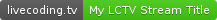
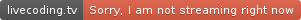
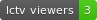
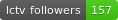
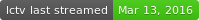

# LCTV Badges

*HTML badges and link buttons for LCTV online status and stream stats*

  
HTML badges and link buttons for LCTV online status and stream stats

  <table id="demos-table">
    <tr><th colspan="4">Online Status Badges                             </th></tr>
    <tr><td>Logo Pill                                                    </td>
        <td></td>
        <td></td>
        <td><a href="http://codiad-billauger.rhcloud.com/demos/demo-nojs.php?title=Online%20Status%20-%20Logo%20Pill&badge-style=online-status-v2">click here for embed code</a></td></tr>
    <tr><td>Glassy Button                                                   </td>
        <td></td>
        <td></td>
        <td><a href="http://codiad-billauger.rhcloud.com/demos/demo.php?title=Online%20Status%20-%20Glassy%20Button&badge-style=online-status-v3">click here for embed code</a></td></tr>
    <tr><td>Customizable SVG Pill                                        </td>
        <td></td>
        <td></td>
        <td><a href="http://codiad-billauger.rhcloud.com/demos/demo-nojs.php?title=Online%20Status%20-%20Customizable%20SVG%20Pill&badge-style=online-status-v1">click here for embed code</a></td></tr>
    <tr><th colspan="4">Number of Viewers Badges                         </th></tr>
    <tr><td>Customizable SVG Pill                                        </td>
        <td colspan="2"></td>
        <td><a href="http://codiad-billauger.rhcloud.com/demos/demo-nojs.php?title=Number%20of%20Viewers%20-%20Customizable%20SVG%20Pill&badge-style=n-viewers-v1">click here for embed code</a></td></tr>
    <tr><th colspan="4">Number of Followers Badges                       </th></tr>
    <tr><td>Customizable SVG Pill                                        </td>
        <td colspan="2"></td>
        <td><a href="http://codiad-billauger.rhcloud.com/demos/demo-nojs.php?title=Number%20of%20Followers%20-%20Customizable%20SVG%20Pill&badge-style=n-followers-v1">click here for embed code</a></td></tr>
    <tr><th colspan="4">Last Streamed Badges                             </th></tr>
    <tr><td>Customizable SVG Pill                                        </td>
        <td colspan="2"></td>
        <td><a href="http://codiad-billauger.rhcloud.com/demos/demo-nojs.php?title=Last%20Stream%20-%20Customizable%20SVG%20Pill&badge-style=last-stream-v1">click here for embed code</a></td></tr>
    <tr><th colspan="4">Next Stream Badges                               </th></tr>
    <tr><td>Customizable SVG Pill                                        </td>
        <td colspan="2"></td>
        <td><a href="http://codiad-billauger.rhcloud.com/demos/demo-nojs.php?title=Next%20Stream%20-%20Customizable%20SVG%20Pill&badge-style=next-stream-v1">click here for embed code</a></td></tr>
  </table>

more styles and features to come once the LCTV REST API is finalized - feel free to post any comments or suggestions to the [issue tracker](https://github.com/bill-auger/lctv-badges/issues)
